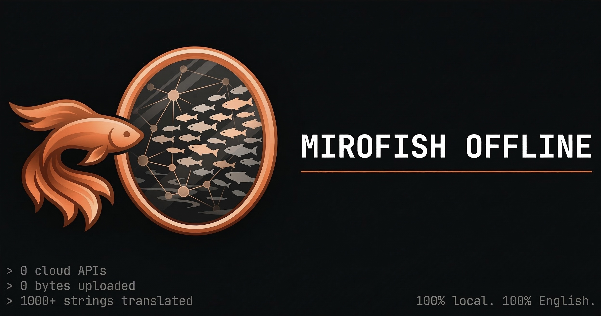
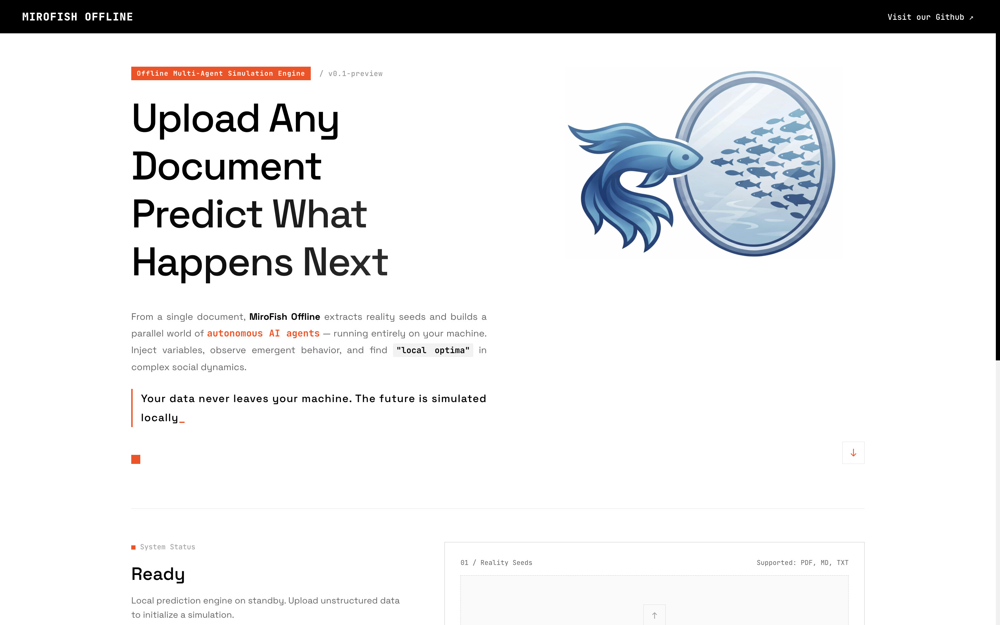

<div align="center">



# MiroFish-Offline

**MiroFish 的完全本地化分支 — 无需云端 API，全中文界面。**

*多智能体群体智能引擎，模拟舆论、市场情绪和社交动态。完全在本地硬件运行。*

[](https://github.com/nikmcfly/MiroFish-Offline/stargazers)
[](https://github.com/nikmcfly/MiroFish-Offline/network)
[](https://hub.docker.com/)
[](./LICENSE)

</div>

## 这是什么？

MiroFish 是一个多智能体模拟引擎：上传任意文档（新闻稿、政策草案、财务报告），它会生成数百个具有独特个性的 AI 智能体，模拟社交媒体上的公众反应。帖子、争论、观点转变 — 实时追踪。

[原始 MiroFish](https://github.com/666ghj/MiroFish) 面向中国市场（中文界面、Zep Cloud 知识图谱、DashScope API）。本分支使其**完全本地化并适配中文**：

| 原始 MiroFish | MiroFish-Offline |
|---|---|
| 中文界面 | **中文界面** |
| Zep Cloud（图谱记忆） | **Neo4j 社区版 5.15** |
| DashScope / OpenAI API（LLM） | **Ollama**（qwen2.5、llama3 等） |
| Zep Cloud 向量嵌入 | **Ollama nomic-embed-text** |
| 需要云端 API Key | **零云端依赖** |

## 工作流程

1. **图谱构建** — 从文档中提取实体（人物、公司、事件）和关系。通过 Neo4j 构建知识图谱，包含个体和群体记忆。
2. **环境设置** — 生成数百个智能体角色，每个都具有独特的个性、观点倾向、反应速度、影响力和对过去事件的记忆。
3. **模拟** — 智能体在模拟社交平台上互动：发帖、回复、争论、转变观点。系统实时追踪情绪演变、话题传播和影响力动态。
4. **报告** — ReportAgent 分析模拟后环境，访谈焦点小组智能体，在知识图谱中搜索证据，生成结构化分析。
5. **互动** — 与模拟世界中的任意智能体聊天。询问他们为什么发表某些观点。完整的记忆和个性持续保留。

## 截图

<div align="center">

</div>

## 快速开始

### 前置要求

- Docker & Docker Compose（推荐），**或**
- Python 3.11+、Node.js 18+、Neo4j 5.15+、Ollama

### 选项 A：Docker（推荐）

```bash
git clone https://github.com/nikmcfly/MiroFish-Offline.git
cd MiroFish-Offline
cp .env.example .env

# 编辑 .env 文件，配置你的 Neo4j 和 Ollama 地址
# 例如：NEO4J_URI=bolt://192.168.2.52:7687
#       LLM_BASE_URL=http://192.168.2.75:11434/v1

# 构建并启动 MiroFish（不包含 Neo4j 和 Ollama，需外部部署）
docker compose up -d --build
```

**注意**：Neo4j 和 Ollama 需要在其他地方单独部署，并在 `.env` 中配置相应地址。

启动后访问 `http://localhost:5001`

### 选项 B：手动部署

**1. 启动 Neo4j**

```bash
docker run -d --name neo4j \
  -p 7474:7474 -p 7687:7687 \
  -e NEO4J_AUTH=neo4j/mirofish \
  neo4j:5.15-community
```

**2. 启动 Ollama 并拉取模型**

```bash
ollama serve &
ollama pull qwen2.5:32b      # LLM（或使用 qwen2.5:14b 减少显存占用）
ollama pull nomic-embed-text  # 向量嵌入（768维）
```

**3. 配置并运行后端**

```bash
cp .env.example .env
# 如果你的 Neo4j/Ollama 不是默认端口，请编辑 .env

cd backend
pip install -r requirements.txt
python run.py
```

**4. 运行前端**

```bash
cd frontend
npm install
npm run dev
```

访问 `http://localhost:3000`（开发模式）或 `http://localhost:5001`（生产模式）

## 配置

所有设置在 `.env` 文件中（从 `.env.example` 复制）：

```bash
# LLM — 指向本地 Ollama（OpenAI 兼容格式）
LLM_API_KEY=ollama
LLM_BASE_URL=http://localhost:11434/v1
LLM_MODEL_NAME=qwen2.5:32b

# Neo4j
NEO4J_URI=bolt://localhost:7687
NEO4J_USER=neo4j
NEO4J_PASSWORD=mirofish

# 向量嵌入
EMBEDDING_MODEL=nomic-embed-text
EMBEDDING_BASE_URL=http://localhost:11434
```

兼容任何 OpenAI 兼容 API — 通过修改 `LLM_BASE_URL` 和 `LLM_API_KEY` 可切换到 Claude、GPT 或其他提供商。

## 架构

本分支在应用和图数据库之间引入了清晰的抽象层：

```
┌─────────────────────────────────────────┐
│              Flask API                   │
│  graph.py  simulation.py  report.py     │
└──────────────┬──────────────────────────┘
               │ app.extensions['neo4j_storage']
┌──────────────▼──────────────────────────┐
│           Service Layer                  │
│  EntityReader  GraphToolsService         │
│  GraphMemoryUpdater  ReportAgent         │
└──────────────┬──────────────────────────┘
               │ storage: GraphStorage
┌──────────────▼──────────────────────────┐
│         GraphStorage (abstract)          │
│              │                            │
│    ┌─────────▼─────────┐                │
│    │   Neo4jStorage     │                │
│    │  ┌───────────────┐ │                │
│    │  │ EmbeddingService│ ← Ollama       │
│    │  │ NERExtractor   │ ← Ollama LLM   │
│    │  │ SearchService  │ ← 混合搜索      │
│    │  └───────────────┘ │                │
│    └───────────────────┘                │
└─────────────────────────────────────────┘
               │
        ┌──────▼──────┐
        │  Neo4j CE   │
        │  5.15       │
        └─────────────┘
```

**关键设计决策：**

- `GraphStorage` 是抽象接口 — 通过实现一个类即可将 Neo4j 替换为其他图数据库
- 通过 Flask `app.extensions` 依赖注入 — 无全局单例
- 混合搜索：0.7 × 向量相似度 + 0.3 × BM25 关键词搜索
- 通过本地 LLM 实现同步 NER/RE 提取（替代 Zep 的异步事件）
- 保留所有原始数据类和 LLM 工具（InsightForge、Panorama、智能体访谈）

## 硬件要求

| 组件 | 最低配置 | 推荐配置 |
|---|---|---|
| 内存 | 16 GB | 32 GB |
| 显存（GPU） | 10 GB（14b 模型） | 24 GB（32b 模型） |
| 磁盘 | 20 GB | 50 GB |
| CPU | 4 核 | 8+ 核 |

纯 CPU 模式可用，但 LLM 推理会显著变慢。对于更轻量的配置，可使用 `qwen2.5:14b` 或 `qwen2.5:7b`。

## 使用场景

- **PR 危机测试** — 在发布前模拟新闻稿的公众反应
- **交易信号生成** — 导入财经新闻，观察模拟市场情绪
- **政策影响分析** — 针对模拟公众反应测试法规草案
- **创意实验** — 有人用它输入了一部古典中文小说（结局丢失）；智能体们写出了一个叙事一致性的结局

## 许可证

AGPL-3.0 — 与原始 MiroFish 项目相同。参见 [LICENSE](./LICENSE)。

## 致谢与归属

这是 [MiroFish](https://github.com/666ghj/MiroFish) 的改进分支，由 [666ghj](https://github.com/666ghj) 创建，最初由 [盛大集团](https://www.shanda.com/) 支持。模拟引擎由 CAMEL-AI 团队的 [OASIS](https://github.com/camel-ai/oasis) 驱动。

**本分支的改进：**

- 后端从 Zep Cloud 迁移到本地 Neo4j CE 5.15 + Ollama
- 整个前端翻译为中文（20 个文件，1000+ 字符串）
- 所有 Zep 引用在 UI 中替换为 Neo4j
- 重命名为 MiroFish Offline
- 支持外部部署 Neo4j 和 Ollama
- 优化 Docker 镜像大小（多阶段构建）
- 简化部署：前端由后端直接服务
